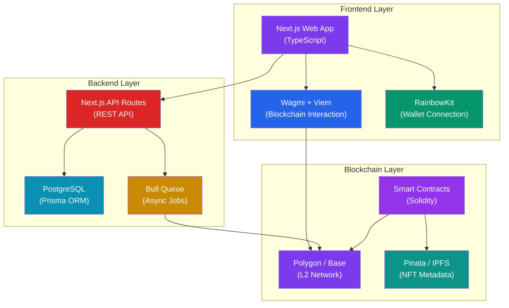
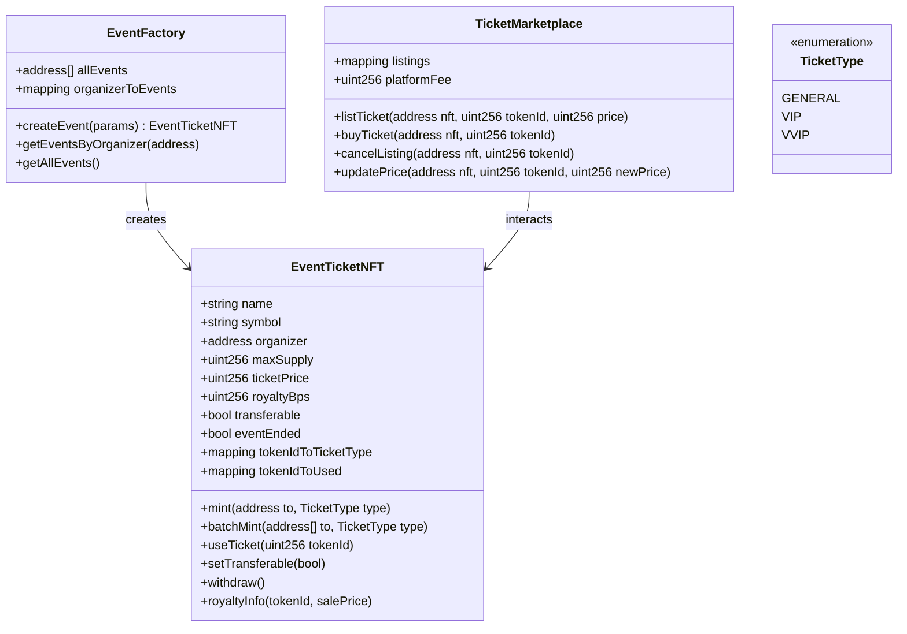
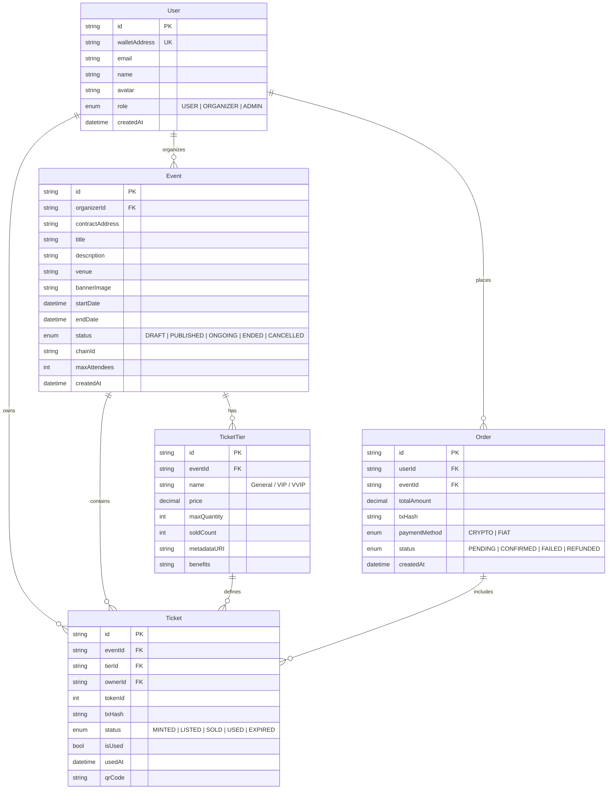

# 🎫 Hệ Thống Bán Vé Sự Kiện NFT — Implementation Plan

## Tổng Quan

Xây dựng hệ thống bán vé sự kiện dưới dạng NFT, cho phép người tổ chức (Organizer) tạo sự kiện & phát hành vé NFT, người dùng (User) mua vé, chuyển nhượng/bán lại vé trên secondary market, và quét vé QR code để check-in tại sự kiện. Hệ thống tận dụng blockchain để đảm bảo tính minh bạch, chống giả mạo, và tạo nguồn thu royalty tự động cho nhà tổ chức.

---

## Open Questions

> [!IMPORTANT]
> ### 1. Lựa chọn Blockchain
> Mình đề xuất sử dụng **Polygon Amoy (testnet)** → **Polygon PoS (mainnet)** vì:
> - Gas fee cực thấp, phù hợp cho ticketing (mass minting)
> - Ecosystem mạnh, nhiều marketplace hỗ trợ
> - Finality nhanh (~2s)
> 
> **Lựa chọn thay thế**: Base Sepolia → Base (Coinbase-backed, OP Stack). Bạn muốn chọn chain nào?

> [!IMPORTANT]
> ### 2. Wallet Strategy
> Có 2 hướng tiếp cận:
> - **Option A**: Yêu cầu MetaMask/wallet truyền thống → đơn giản hơn để implement
> - **Option B**: Account Abstraction (email/social login) với Thirdweb → UX tốt hơn nhưng phức tạp hơn
> 
> Mình đề xuất **Option A trước** (MVP), sau đó nâng cấp lên Option B. Bạn có đồng ý không?

> [!IMPORTANT]
> ### 3. Scope & Phân pha
> Mình chia thành 5 phase. Bạn muốn focus vào phase nào trước? Hay implement tuần tự?

---

## Kiến Trúc Hệ Thống



---

## Tech Stack Chi Tiết

### 🖥️ Frontend

| Công nghệ | Version | Lý do chọn |
|:---|:---|:---|
| **Next.js** | 14+ (App Router) | SSR/SSG, API Routes tích hợp, SEO tốt, ecosystem mạnh |
| **TypeScript** | 5.x | Type safety, DX tốt, bắt lỗi sớm |
| **Wagmi** | 2.x | React hooks cho blockchain interaction, type-safe, modern |
| **Viem** | 2.x | Thay thế Ethers.js — nhẹ hơn, type-safe, bundle size nhỏ |
| **RainbowKit** | 2.x | UI wallet connection đẹp, hỗ trợ nhiều wallet |
| **TanStack Query** | 5.x | Server state management, caching, real-time sync |
| **Zustand** | 4.x | Client state management nhẹ |
| **Framer Motion** | 11.x | Animations mượt mà |
| **CSS** | Vanilla CSS / CSS Modules | Flexible, không dependency thêm |

### ⚙️ Backend

| Công nghệ | Lý do chọn |
|:---|:---|
| **Next.js API Routes** | Tích hợp sẵn, không cần server riêng, deploy dễ |
| **Prisma ORM** | Type-safe database access, migration tự động, DX tuyệt vời |
| **PostgreSQL** | Reliable, hỗ trợ JSON, full-text search, scalable |
| **NextAuth.js** | Authentication linh hoạt (email, social, wallet) |
| **Bull/BullMQ** | Job queue cho async blockchain operations |
| **Redis** | Caching + Bull queue backend |

### ⛓️ Blockchain

| Công nghệ | Lý do chọn |
|:---|:---|
| **Solidity** | 0.8.20+ — ngôn ngữ smart contract phổ biến nhất |
| **Hardhat** | Dev framework quen thuộc, plugin ecosystem mạnh, JS/TS native |
| **OpenZeppelin** | Library smart contract đã audit, battle-tested |
| **ERC-721** | Mỗi vé là unique NFT (có seat, serial number) |
| **ERC-2981** | Royalty standard — marketplace tự động trả royalty |
| **Polygon PoS** | L2 với gas fee thấp, finality nhanh |
| **Pinata** | IPFS pinning cho NFT metadata (free tier 1GB) |
| **Alchemy** | RPC provider ổn định, free tier đủ dùng |

### 🛠️ DevOps & Tools

| Công nghệ | Lý do chọn |
|:---|:---|
| **Vercel** | Deploy Next.js tối ưu, preview deployments |
| **GitHub Actions** | CI/CD, auto-run tests & linting |
| **Slither** | Static analysis cho smart contracts |
| **ESLint + Prettier** | Code quality & formatting |

---

## Smart Contract Design

### Contract Architecture



### Key Smart Contract Features

1. **EventTicketNFT (ERC-721 + ERC-2981)**
   - Mint vé với các loại: General, VIP, VVIP
   - Mỗi vé có metadata riêng (seat, gate, barcode)
   - Royalty tự động khi bán lại (EIP-2981)
   - `useTicket()` — đánh dấu vé đã sử dụng (check-in)
   - `setTransferable()` — organizer có thể khóa chuyển nhượng
   - Anti-scalping: giới hạn số vé mỗi wallet
   - Withdraw pattern (pull-over-push)

2. **EventFactory**
   - Factory pattern để tạo event mới
   - Mỗi event = 1 contract riêng biệt
   - Quản lý danh sách events theo organizer

3. **TicketMarketplace**
   - Secondary market cho vé
   - Tự động enforce royalty + platform fee
   - Price ceiling (chống đội giá)
   - Chỉ cho phép list vé transferable

---

## Database Schema (PostgreSQL + Prisma)



---

## Cấu Trúc Thư Mục

```
d:\HK8\TicketNFT\
├── contracts/                    # Smart Contracts (Hardhat)
│   ├── contracts/
│   │   ├── EventTicketNFT.sol
│   │   ├── EventFactory.sol
│   │   └── TicketMarketplace.sol
│   ├── test/
│   │   ├── EventTicketNFT.test.ts
│   │   ├── EventFactory.test.ts
│   │   └── TicketMarketplace.test.ts
│   ├── scripts/
│   │   └── deploy.ts
│   ├── hardhat.config.ts
│   └── package.json
│
├── web/                          # Next.js Web App
│   ├── src/
│   │   ├── app/                  # App Router pages
│   │   │   ├── layout.tsx
│   │   │   ├── page.tsx          # Landing page
│   │   │   ├── events/
│   │   │   │   ├── page.tsx      # Browse events
│   │   │   │   └── [id]/
│   │   │   │       └── page.tsx  # Event detail + buy
│   │   │   ├── dashboard/
│   │   │   │   ├── page.tsx      # User dashboard
│   │   │   │   └── organizer/
│   │   │   │       ├── page.tsx  # Organizer dashboard
│   │   │   │       └── create/
│   │   │   │           └── page.tsx  # Create event
│   │   │   ├── marketplace/
│   │   │   │   └── page.tsx      # Secondary market
│   │   │   ├── my-tickets/
│   │   │   │   └── page.tsx      # My tickets + QR
│   │   │   └── api/              # API Routes
│   │   │       ├── auth/
│   │   │       ├── events/
│   │   │       ├── tickets/
│   │   │       └── upload/
│   │   ├── components/
│   │   │   ├── layout/           # Header, Footer, Sidebar
│   │   │   ├── events/           # EventCard, EventList, etc.
│   │   │   ├── tickets/          # TicketCard, QRCode, etc.
│   │   │   ├── marketplace/      # ListingCard, etc.
│   │   │   ├── wallet/           # ConnectButton, etc.
│   │   │   └── ui/               # Button, Modal, Input, etc.
│   │   ├── hooks/                # Custom React hooks
│   │   │   ├── useContract.ts
│   │   │   ├── useTickets.ts
│   │   │   └── useEvents.ts
│   │   ├── lib/                  # Utilities
│   │   │   ├── wagmi.ts          # Wagmi config
│   │   │   ├── contracts.ts      # Contract ABIs + addresses
│   │   │   ├── pinata.ts         # IPFS upload
│   │   │   └── prisma.ts         # Prisma client
│   │   ├── styles/
│   │   │   └── globals.css
│   │   └── types/
│   │       └── index.ts
│   ├── prisma/
│   │   └── schema.prisma
│   ├── public/
│   ├── next.config.js
│   └── package.json
│
├── .env.example
├── .gitignore
└── README.md
```

---

## Phân Pha Phát Triển

### Phase 1: Foundation & Smart Contracts ⏱️ ~1 tuần
> Setup project, viết & test smart contracts

- [ ] Khởi tạo monorepo (contracts/ + web/)
- [ ] Setup Hardhat + TypeScript + OpenZeppelin
- [ ] Viết `EventTicketNFT.sol` (ERC-721 + ERC-2981)
- [ ] Viết `EventFactory.sol`
- [ ] Viết test cases đầy đủ (Hardhat + Chai)
- [ ] Deploy lên testnet (Polygon Amoy / Base Sepolia)
- [ ] Verify contracts trên block explorer

### Phase 2: Web App Core ⏱️ ~1.5 tuần
> Setup Next.js, wallet connection, database

- [ ] Khởi tạo Next.js 14 + TypeScript
- [ ] Setup Wagmi + Viem + RainbowKit (wallet connection)
- [ ] Setup Prisma + PostgreSQL + schema migration
- [ ] Implement NextAuth.js (wallet-based auth)
- [ ] Build design system (CSS variables, components cơ bản)
- [ ] Landing page (hero, features, CTA)
- [ ] Browse Events page (list, filter, search)

### Phase 3: Core Features ⏱️ ~2 tuần
> Mua vé, tạo sự kiện, quản lý vé

- [ ] Event Detail page + Buy Ticket flow
- [ ] Organizer: Create Event form → deploy contract
- [ ] Mint NFT ticket khi mua (interact with contract)
- [ ] Upload metadata lên IPFS (Pinata)
- [ ] My Tickets page + hiển thị NFT
- [ ] QR Code generation cho mỗi vé
- [ ] User Dashboard (purchase history, owned tickets)
- [ ] Organizer Dashboard (event stats, revenue)

### Phase 4: Marketplace & Advanced ⏱️ ~1.5 tuần
> Secondary market, check-in, notifications

- [ ] Viết `TicketMarketplace.sol` + tests
- [ ] Marketplace page (list, buy, cancel listings)
- [ ] Royalty enforcement khi bán lại
- [ ] Check-in system (scan QR → verify on-chain → mark used)
- [ ] Event status management (publish, end, cancel)
- [ ] Real-time notifications (ticket sold, event reminder)

### Phase 5: Polish & Deploy ⏱️ ~1 tuần
> UI/UX polish, testing, deployment

- [ ] UI/UX polish (animations, responsive, dark mode)
- [ ] Error handling & loading states
- [ ] Security review (smart contracts + API)
- [ ] E2E testing
- [ ] Performance optimization
- [ ] Deploy to Vercel (frontend) + Mainnet (contracts)
- [ ] Documentation (README, API docs)

---

## Tính Năng Chi Tiết Theo Role

### 👤 User (Người mua vé)
| Tính năng | Mô tả |
|:---|:---|
| Connect Wallet | Kết nối MetaMask/WalletConnect |
| Browse Events | Xem danh sách sự kiện, filter theo category/date |
| Buy Ticket | Chọn loại vé, thanh toán crypto, nhận NFT |
| My Tickets | Xem vé đã mua, QR code, trạng thái |
| Transfer Ticket | Chuyển vé cho người khác |
| List on Marketplace | Đăng bán vé trên secondary market |
| Check-in | Quét QR tại sự kiện |

### 🏢 Organizer (Nhà tổ chức)
| Tính năng | Mô tả |
|:---|:---|
| Create Event | Tạo sự kiện, thiết lập tiers, deploy contract |
| Manage Event | Cập nhật thông tin, publish/cancel |
| Revenue Dashboard | Xem doanh thu, số vé bán, royalty |
| Check-in Scanner | Quét QR check-in attendees |
| Set Royalty | Thiết lập % royalty cho secondary sales |
| Withdraw Funds | Rút tiền từ contract |

### 🔧 Admin
| Tính năng | Mô tả |
|:---|:---|
| Platform Overview | Tổng quan hệ thống |
| Manage Users | Duyệt organizer, ban user |
| Platform Fee | Thiết lập phí platform |

---

## Verification Plan

### Automated Tests
```bash
# Smart Contract Tests
cd contracts && npx hardhat test

# Static Analysis
slither contracts/contracts/

# Frontend lint & type check
cd web && npm run lint && npm run type-check

# E2E Tests (nếu có)
cd web && npx playwright test
```

### Manual Verification
1. **Smart Contract**: Deploy lên testnet → mint, transfer, list, buy trên marketplace → verify royalty
2. **Frontend**: Test full flow trên browser → connect wallet → browse → buy → check my tickets
3. **QR Check-in**: Generate QR → scan → verify ticket marked as used on-chain
4. **Responsive**: Test trên mobile, tablet, desktop
5. **Security**: Review contract với Slither, check reentrancy, access control

---

## Rủi Ro & Mitigation

| Rủi ro | Mức độ | Giải pháp |
|:---|:---|:---|
| Gas fee spike | Trung bình | Sử dụng L2 (Polygon), batch operations |
| Smart contract bug | Cao | OpenZeppelin, extensive testing, Slither |
| Scalping/bot | Trung bình | Giới hạn vé/wallet, whitelist, queue |
| IPFS data loss | Thấp | Pinata pinning + backup metadata on DB |
| User không quen Web3 | Cao | UX tối giản, hướng dẫn rõ ràng, Phase sau thêm AA |
